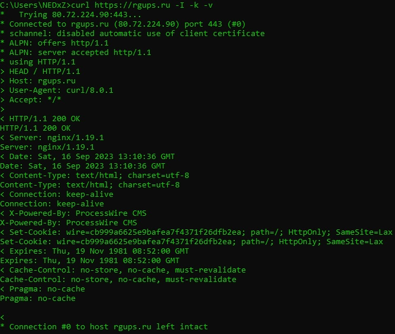

Лабораторная работа №1 
=======================

>**curl (Client URL)** - это инструмент командной строки, предназначенный для передачи данных с сервера и на сервер, используя различные протоколы.  
> **Использованные опции:**
>* **-I** — Показывает только информацию о документе  
>* **-k** — Разрешает небезопасные подключения к серверу *(не проверяет сертификат)* 
>* **-v** — Делает curl более подробным. Позволяет посомтреть что происходит *"под капотом".* 
>  

 
 

 

[‍🎓 РГУПС](https://www.rgups.ru)
--------------------

curl https://rgups.ru -I -k -v

>**Заголовки**
>--------------------
>* ***Server:*** Содержит информацию о программном обеспечении, которое использует исходный сервер, чтобы обработать запрос.
>* ***Date:*** Содержит дату и время, в которые был отправлен запрос.
>* ***Content-Type:*** Указывает тип носителя ресурса.
>* ***Connection:*** Определяет, останется ли сетевое подключение открытым после завершения текущей транзакции.
>* ***X-Powered-By:*** Может быть задан средой размещения или другими фреймворками и содержит информацию о них.
>* ***Set-Cookie:*** Отправляйте файлы cookie с сервера пользовательскому агенту.
>* ***Expires:*** Дата/время, после которого ответ считается устаревшим.
>* ***Cache-Control*** Директивы для механизмов кэширования.
>* ***Pragma:*** Заголовок, зависящий от реализации, который может иметь различные эффекты в любом месте цепочки запрос-ответ. Используется для обратной совместимости с кэшами HTTP/1.0, где заголовок Cache-Control еще не присутствует.
>
> 

 

[Github](https://github.com/)
--------------------
curl https://github.com/ -I -v -k

>**Заголовки**
>--------------------
>* ***Vary:*** Определяет, как сопоставлять заголовки запросов, чтобы решить, можно ли использовать кэшированный ответ, а не запрашивать новый с исходного сервера.
>* ***ETag:*** Уникальная строка, идентифицирующая версию ресурса. Условные запросы, использующие If-Match и If-None-Match, используют это значение для изменения поведения запроса.
>* ***Strict-Transport-Security:*** Принудительное подключение с использованием HTTPS вместо HTTP.
>* ***X-Frame-Options:*** Указывает, следует ли разрешить браузеру отображать страницу в \<frame>, \<iframe>, \<embed> или \<object>.
>* ***X-Content-Type-Options:*** Отключает прослушивание MIME и заставляет браузер использовать тип, указанный в Content-Type.
>* ***X-XSS-Protection:*** Включает фильтрацию межсайтовых сценариев.
>* ***Referrer-Policy:*** Определяет, какая информация о реферере, отправленная в заголовке "Referer", должна быть включена в сделанные запросы.
>* ***Content-Security-Policy:*** Управляет ресурсами, которые пользовательскому агенту разрешено загружать для данной страницы.
>* ***Accept-Ranges:*** Указывает, поддерживает ли сервер запросы диапазона, и если да, то в каких единицах измерения диапазон может быть выражен.
>
> 

 

[🚝 РЖД](https://www.rzd.ru/)
----------------------------------

curlhttps://www.rzd.ru/ -I -v -k
>**Заголовки**
>--------------------
>* ***Via:*** Добавляется прокси-серверами, как прямыми, так и обратными прокси-серверами, и может отображаться в заголовках запросов и ответов.
>* ***Content-Length:*** Размер ресурса в десятичном количестве байт. 
>
> 

 

[🕸 Яндекс](https://yandex.ru/)
----------------------------------
>**Заголовки**
>--------------------
>* ***Accept-CH:*** Серверы могут рекламировать поддержку клиентских подсказок, используя поле заголовка Accept-CH или эквивалентный HTML-элемент \<meta> с атрибутом http-equiv.
>* ***Location:*** Указывает URL-адрес, на который следует перенаправить страницу.
>* ***NEL:*** Определяет механизм, позволяющий разработчикам объявлять политику сообщений о сетевых ошибках.
>* ***P3P:*** Протокол, позволяющий сайтам информировать браузер о предполагаемом получении личных данных пользователя.
>* ***Report-To:*** Используется для указания конечной точки сервера, на который браузер будет отправлять предупреждения и отчеты об ошибках.
>* ***X-Robots-Tag:*** HTTP-заголовок X-Robots-Tag используется для указания того, как веб-страница должна быть проиндексирована в результатах общедоступного поиска.
>
> 

 

[🐍 Python](https://www.python.org/)
----------------------------------
>**Заголовки**
>--------------------
>* ***Age:*** Время, в секундах, в течение которого объект находился в кэше прокси-сервера
>* ***X-Served-By:*** Идентификатор серверов быстрого кэширования, обрабатывающих ответ.
>* ***X-Cache:*** Указывает, был ли запрос принят или пропущен
>* ***X-Cache-Hits:*** Список, указывающий количество обращений к кэшу в каждом узле
>* ***X-Timer:*** Информация о сроках получения ответа
>
> 

 

[Saint 🌠 GIT](https://git-scm.com/)
----------------------------------
>**Заголовки**
>--------------------
>* ***X-Download-Options:*** Отключает возможность открытия файла непосредственно при загрузке.
>* ***X-Permitted-Cross-Domain-Policies:*** Указывает, является ли файл междоменной политики (crossdomain.xml ) разрешен.
>* ***Etag:*** Уникальная строка, идентифицирующая версию ресурса. Условные запросы, использующие If-Match и If-None-Match, используют это значение для изменения поведения запроса.
>* ***X-Request-Id:*** Используется для отслеживания отдельных HTTP-запросов от клиента к серверу и обратно. Это позволяет клиенту и серверу соотносить каждый HTTP-запрос.
>* ***X-Runtime:*** Используется для указания времени, необходимого приложению для обработки каждого запроса
>* ***CF-RAY:*** Уникальным идентификатором от CloudFlare и указывает на то, что ресурс был обслужен через CloudFlare. Заголовок ответа CF-Cache-Status конкретно указывает, был ли файл из кэша или нет.
>
> 

 

[🐵 Jetbrains](https://www.jetbrains.com/)
----------------------------------
>**Заголовки**
>--------------------
>* ***Alt-Svc:*** Используется для перечисления альтернативных способов доступа к этой службе.
>
> 

 

[💪 VSC - this is best choose](https://code.visualstudio.com/)
----------------------------------
>**Заголовки**
>--------------------
>* ***x-azure-ref:*** Уникальная ссылочная строка, которая идентифицирует запрос, обслуживаемый Azure Front Door. Он используется для поиска журналов доступа и критически важен для устранения неполадок.
>
> 